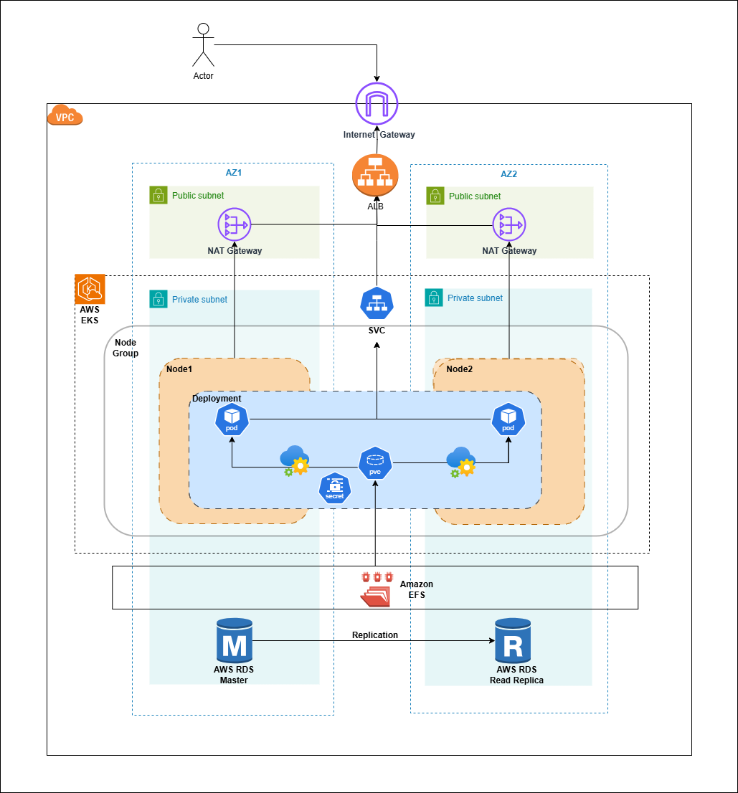
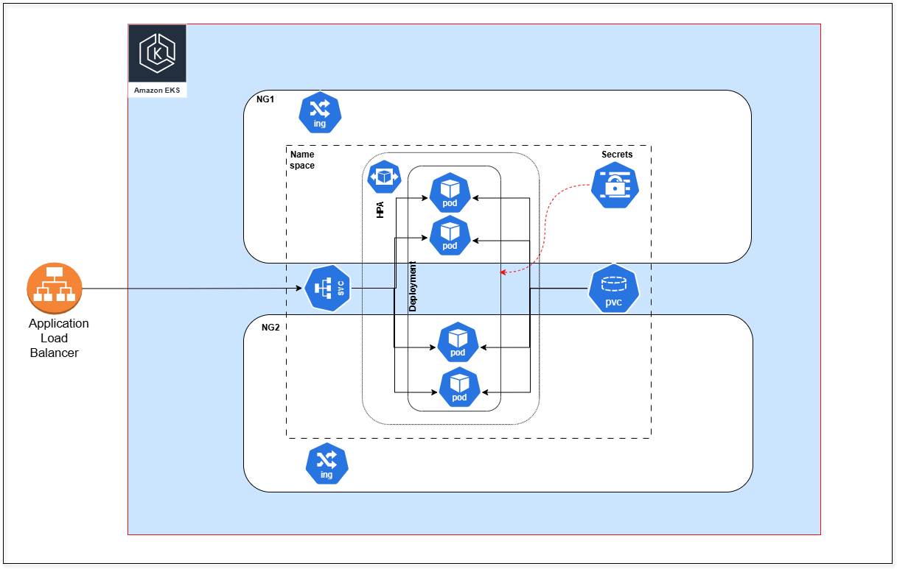

# Kimai-Assignment

## Overview
Below are theree possible ways to deploy Kimai application in Docker container:
1. **Docker Compose** - Best for local or small deployments.
2. **AWS ECS (Fargate or EC2)** - Best for managed container deployment.
3. **Kubernetes (EKS, GKE, AKS, or self-hosted)** - Best for scaling and high availability.

---

## Option 1: Docker Compose (Best for local or small deployments)
### **Architecture**
- **Host Machine** (EC2 instance, VM)
- **Docker Daemon** (Runs containers)
- **Docker Compose** (Orchestrates multi-container applications)
- **Kimai Container** (Application service)
- **database Container** (Database service)
- **Reverse Proxy (NGINX)** (for SSL and routing)
- **Ansible** (Ansible playbook to deploy this docker compose file on desied machine, also used ansible vault to encrypt the env variable, we have encrypt the value of passwords and used jinja template to create to use this variable). Now, we need to decrypt this playbook at a runtime.

### **Pros**
- Easy to set up and manage.
- Suitable for small teams or internal use.
- Minimal overhead and straightforward debugging.

### **Cons**
- Lacks scalability and high availability.
- No built-in load balancing.

---

## Option 2: AWS ECS (Elastic Container Service)
### **Architecture**
- **AWS ECS Cluster** (Managed container orchestration)
- **Fargate**
- **Kimai Task**: Create the task using provided kimai-task-def.json file
- **Kimai Service**: This comonent handles the deploument strategy for task and also make sure that desired number of task is running.
- **database on RDS**: To store the data of application
- **Application Load Balancer (ALB)**: To expose the application to enduser.

### **Pros**
- Fully managed by AWS, reducing operational overhead.
- Easier to scale compared to Docker Compose.

### **Cons**
- Limited flexibility compared to Kubernetes.
- More AWS dependency.

---

## Option 3: Kubernetes (EKS, GKE, AKS, or Self-hosted)
### **Architecture**
- **Kubernetes Cluster** (Managed via EKS, GKE, AKS, or self-hosted)
- **Kimai Deployment** (Runs in pods)
- **AWS RDS** (Database backend)
- **Persistent Volumes (EFS)** (For database storage)
- **Ingress Controller** (For traffic routing)
- **Horizontal POD Autoscaler** (For POD autoscaling)

### **Pros**
- Highly scalable and available.
- Supports complex deployments and auto-healing.
- Suitable for enterprise environments.

### **Cons**
- Higher complexity and operational overhead.
- Requires Kubernetes knowledge.

## EKS Deployment Architecture for Kimai
The diagram represents a highly available and scalable architecture for deploying the Kimai application using AWS EKS.

 

### **Components Explained:**
- **VPC**: The entire infrastructure is deployed within a Virtual Private Cloud (VPC) for security and networking control.
- **Internet Gateway**: Allows public internet access for users interacting with the application.
- **Public Subnets**: Contains NAT Gateways to enable outbound internet access for private instances.
- **Private Subnets**: Houses the EKS cluster, keeping the Kimai application isolated from the public internet.
- **EKS Cluster**: Kubernetes cluster running the Kimai application in a managed environment.
- **Node Groups**: Consist of multiple worker nodes running in private subnets.
- **Kimai Deployment**: Runs within Kubernetes pods, ensuring scalability and availability. We have used rolling update strategy. In addition to this we have configured some variable, labels and annotation related to Datadog logging and Monitoring. Also leverage the liveliness and readiness probe to check the health of conatiner and application.
- **AWS RDS (Master & Read Replica)**: Managed relational database for Kimai, ensuring data durability and read scalability.
- **Amazon EFS**: Provides shared storage across multiple pods and ensures persistent storage.
- **Application Load Balancer (ALB)**: Distributes incoming traffic to the Kimai service running in EKS.
- **Service (SVC)**: Service will going to forard traffic from Ingress resource to Kimai application.
- **Secret**: We are using secret resource to pass the DB connection string and password onto the application deployment file.
- **Replication**: This is to make sure that we have HA setup in case if anything goes wrong with Master database, we can promote reader instance as master.
- **HPA**: Horizontal POD autoscaler is used to scale the POD based on the resources. In order to make HPA work we need to install metrics server on the cluster.
- **Cluster Autoscaler**: We can also use cluster autoscaler in ordere to scale up and scale down the nodes if required.
- **Ingress Resources**: We also need to use ingress resource which will be responsible to forward trafiic to particular service based on path.
- **Monitoring**: For monitoring purpose, we need to install the helm chart for datadog. Need to use the following command for the same. This command will install datadog agent as daemon set on the cluster.
  1. helm repo add datadog https://helm.datadoghq.com
  2. helm repo update
  3. kubectl create secret generic datadog-secret --from-literal api-key=<DATADOG_API_KEY>

  Now, we need to configure the datadog-values.yml file with required options. We have already used variable, labels and annotation related to Datadog logging and Monitoring. Once the this setup completes we can start to see the logs and performance of our application in datadog.

- **CI/CD**: As a part of CI/CD we have used GitHub actions. In GitHub action I have write one Dockerfile. So, as a part of CI it will check out the repo, assumed we are using self hosted runner for GitHub ction as we can be able to connect to this instance for debugging and it is best from security point of view as well, where we installed required software such as docker, aws, npm, kubectl, etc.... and then it will going to build the image, scan the image for it's vulnerability, run some test cases for that and upload that image on docker repo.
Once that image has been uplaoded to docker repo, we will going to download that image, we will ask for approval if the environment is production,  and then we will update the image tag in our deployment manifest file.

- If we are using GitHub provided runner then the authentication mechanism will going to change as we can't attach any role to the runner. In that case we need to setup OIDC provider for authenticating the GitHub for the EKS cluster. We need to create new identity provider with url https://token.actions.githubusercontent.com/ and then need assign role to this identity provider. Need to selkect web identity as a trusted policy and then need to attach required permisison for the same. Then we can use RBAC same way as we used earlier and need to whitelist the service account and IAM role arn in aws-auth config map.

- **EKS Authentication for CI/CD**: We will going to create an IAM role in AWS that self-hosted runner will use. This IAM role should have permissions to interact with EKS cluster. This IAM role will help us to authenticate with cluster. However, we have used ClusterRole and ClusterRole Binding in conjuction with IAM role so that we can also limit what are all action we can perform on this cluster.
 

This architecture is suitable for **high availability, auto-scaling, and security**, making it production ready for application like Kimai.